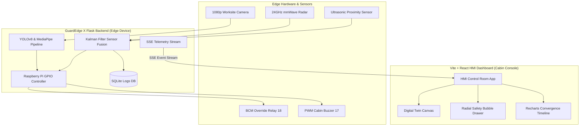

# GuardEdge X: AI-Powered Predictive Safety Copilot

[](LICENSE)
[](#)
[](#)

**GuardEdge X** is an advanced, industrial-grade Edge AI predictive safety copilot designed for heavy machinery operators (e.g., excavators, loaders, dumpers). Integrating multi-modal sensor fusion, computer vision, and real-time HMI dashboards, GuardEdge X actively monitors worksite safety zones, predicts worker collision vectors, detects PPE non-compliance, tracks operator fatigue, and executes automated ignition cut-offs via hardware override relays.

---

## ⚡ Key Capabilities

* **24GHz mmWave & Ultrasonic Fusion:** Merges dual-channel depth sensors using dynamic Kalman filter tracking to establish active distance sweeps.
* **YOLOv8 + DeepSORT Target Tracking:** Runs localized worksite optical tracking to detect worker boxes and calculate bearing trajectories.
* **Continuous PPE Compliance Verification:** Monitors safety helmet and high-visibility vest compliance using a multi-class CNN pipeline.
* **Real-time Operator Attention Analytics:** Extracts EAR (Eye Aspect Ratio), MAR (Mouth Aspect Ratio), and Head Pitch values to trigger fatigue warnings.
* **MediaPipe Hand Gesture Override:** Allows operators or ground staff to signal a physical stop/resume command using CNN hand-gesture classifications.
* **SAE J1939 CAN-Bus Diagnostics:** Polls real-time engine metrics (RPM, boom angles, bucket heights, coolant/oil temperatures) directly from the vehicle bus.
* **3D Worksite Digital Twin:** Renders a top-down digital twin simulation showing real-time target coordinates and safety bubble envelopes.

---

## ⚙️ System Architecture



---

## 🔌 Hardware Harness Map (Raspberry Pi 5 GPIO)

| Hardware Component | GPIO Pin Type | BCM Mapping | Action State |
|:---|:---|:---|:---|
| **E-Stop Override Relay** | Output (Solenoid cut-off) | **Pin 18** | **HIGH** = Ignition Cut / **LOW** = Nominal Run |
| **Cabin Warning Horn** | Output (PWM Alarm Audio) | **Pin 17** | **PWM Active** = 85dB Safety Pulse Alert |
| **System Status LED** | Output (Indicator LED) | **Pin 22** | **HIGH** = Pipeline Online |

---

## 📦 Directory Structure

```text
GuardEdge-X-Safety-Copilot/
├── guardedge_x_backend/
│   ├── app.py                # Flask Server, OpenCV, and Kalman simulation loop
│   ├── guardedge_x.db        # SQLite Event logs database
│   └── requirements.txt      # Python backend dependencies
├── guardedge_x_frontend/
│   ├── src/
│   │   ├── App.tsx           # React HMI Dashboard & Recharts canvases
│   │   ├── index.css         # Glassmorphic custom CSS styling tokens
│   │   └── main.tsx          # Application entrypoint
│   ├── package.json          # Frontend packages and scripts
│   ├── tsconfig.json         # TypeScript configuration
│   └── vite.config.ts        # Vite HMR dev server configuration
├── LICENSE                   # MIT License
└── README.md                 # Project Documentation
```

---

## 🚀 Quick Start Guide

### 1. Pre-requisites
Ensure you have the following installed on your machine:
* **Python 3.10+**
* **Node.js v18+** & **npm**

### 2. Backend Installation & Boot
Navigate to the backend directory, install requirements, and run the server:
```bash
cd guardedge_x_backend
pip install -r requirements.txt
python app.py
```
*The Flask backend server will launch on [http://localhost:5000](http://localhost:5000) and initialize the SQLite database.*

### 3. Frontend Installation & Boot
Navigate to the frontend directory, install node modules, and start the Vite dev server:
```bash
cd ../guardedge_x_frontend
npm install
npm run dev
```
*The HMI Control Room interface will open immediately on [http://localhost:5173](http://localhost:5173).*

---

## 📡 API Endpoints Spec

| Method | Endpoint | Description | Payload Schema |
|:---|:---|:---|:---|
| **GET** | `/api/telemetry` | Server-Sent Events (SSE) telemetry data feed | *Streaming JSON Event* |
| **POST**| `/api/settings` | Updates active parameters (e.g. override gesture status) | `{"active_gesture": "STOP"}` |
| **GET** | `/api/report` | Exports worksite compliance audit statistics report | *TXT File Stream* |

---

## 📜 License
This project is licensed under the **MIT License** - see the [LICENSE](LICENSE) file for details.
