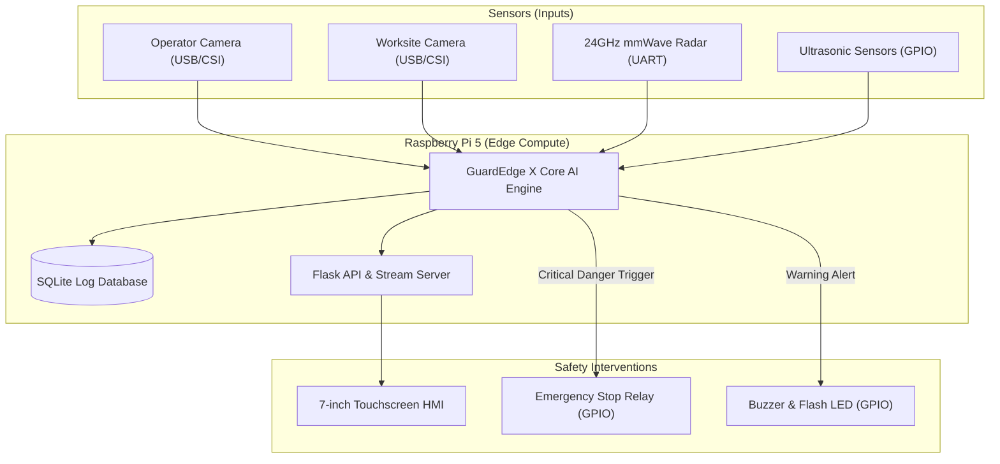
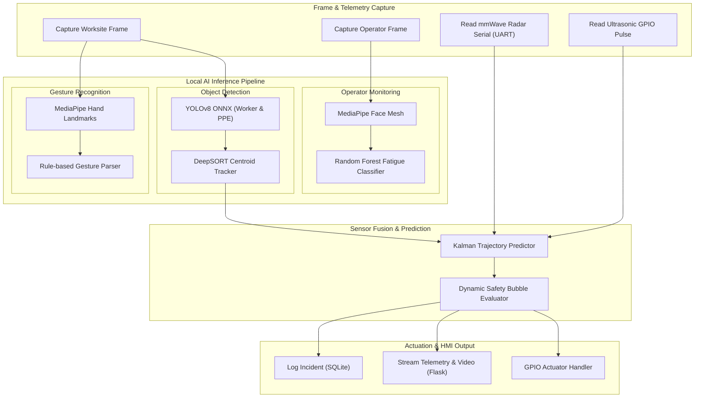
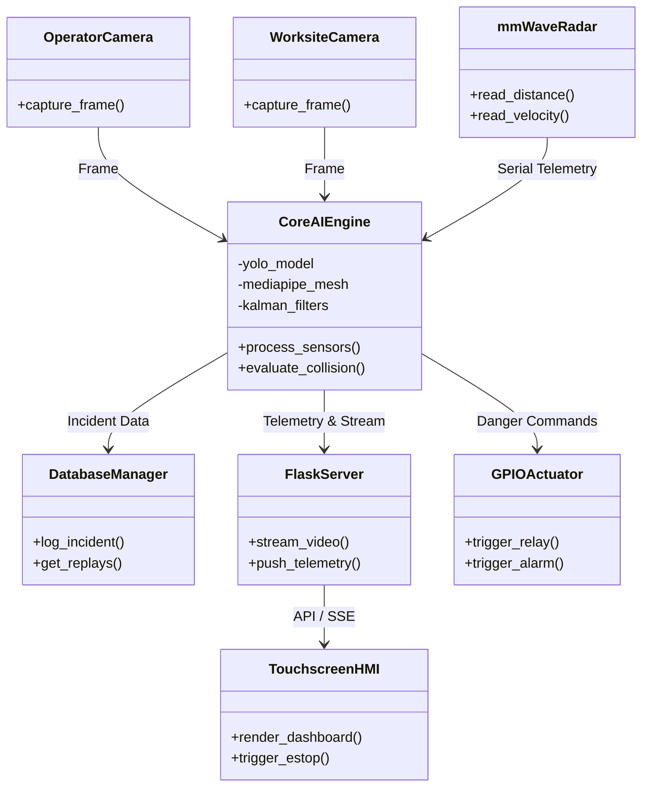
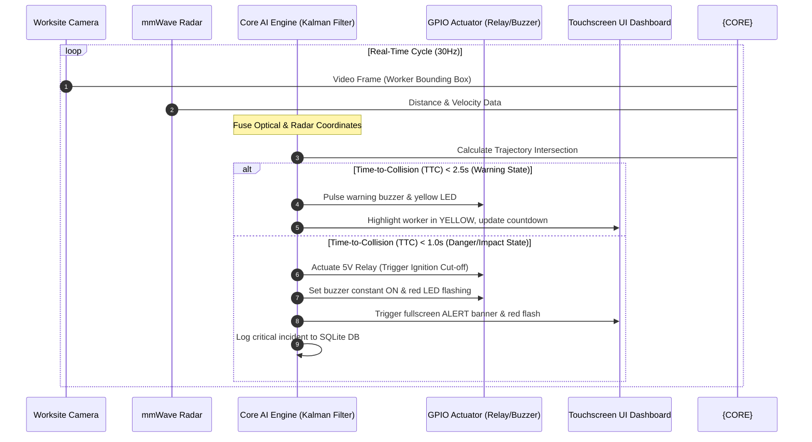
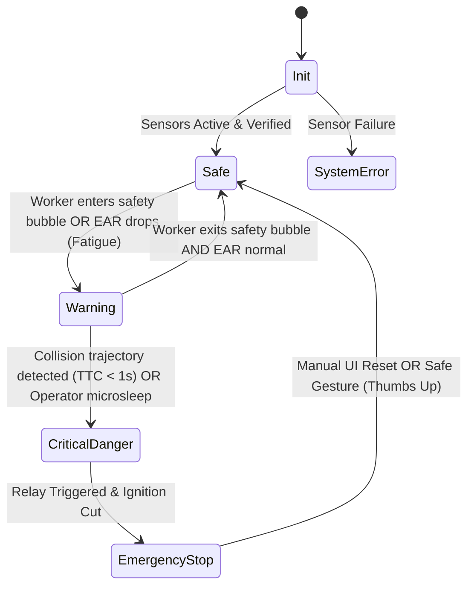
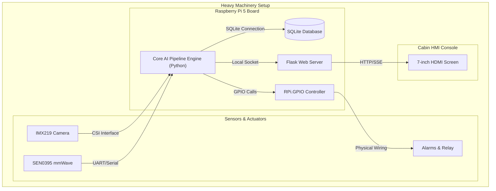

# GuardEdge X: Technical Systems Design Manual
## Edge AI Copilot for Predictive Human–Machine Safety in Heavy Machinery

This document contains the complete technical architecture and engineering specifications for **GuardEdge X**, prepared for the Tata Technologies InnoVent 2026 submission.

---

## 1. System Overview

GuardEdge X is an industrial-grade, fully offline Edge AI copilot designed to prevent human-machine collision accidents and monitor operator safety on heavy industrial machinery (excavators, loaders, dozers). Operating directly on a **Raspberry Pi 5**, it merges multi-modal sensors (cameras, mmWave radar, ultrasonic) and processes them locally with sub-100ms latency to detect, predict, and prevent safety incidents.

---

## 2. Hardware Architecture

The prototype is designed using off-the-shelf industrial and edge computing components:

| Component | Specification | Purpose |
| :--- | :--- | :--- |
| **Edge Processor** | Raspberry Pi 5 (8GB LPDDR5 RAM) | Core processor running AI pipelines, database, and local server. |
| **Operator Camera** | 120 FPS USB Infrared Camera (720p) | Captures operator facial features under all lighting conditions (cabin environment). |
| **Worksite Camera** | Sony IMX219 CSI Camera (120° Wide Angle) | Captures worksite field of view behind/around the heavy machinery. |
| **mmWave Radar** | 24GHz mmWave Radar (DFRobot SEN0395) | High-accuracy micro-motion distance detection (works through dust, rain, and fog). |
| **Ultrasonic Sensors** | Dual HC-SR04 | Short-range backup proximity detection (0.1m to 4m). |
| **Actuator Relay** | 5V 10A Optocoupler Relay Module | Intercepts machine ignition/solenoid line to trigger physical Emergency Stop (E-Stop). |
| **Notification Board** | Active Buzzer (85dB) + Ultra-bright Orange LED | Physical local alarms for ground workers and operator. |
| **Human Interface** | 7-inch IPS HDMI Touchscreen (1024x600) | Local operator cabin dashboard displaying alerts and video stream. |
| **Power System** | LiFePO4 Battery Pack (12V 6Ah) with 5V/5A Buck Regulator | Provides clean, continuous power to the Pi and sensors, isolated from engine noise. |

---

## 3. Software Architecture & Sensor Fusion Pipeline

The software stack runs entirely on **Debian Bookworm (Raspberry Pi OS)**, utilizing a modular, multi-threaded pipeline:

### Sensor Fusion Protocol
- **Optical + Radar Fusion (Asynchronous):** YOLOv8 provides angular position and bounding-box based distance estimates. The mmWave Radar provides highly accurate radial velocity and absolute distance. The system uses a **Extended Kalman Filter (EKF)** to merge these readings. If optical tracking is lost due to dust or glare, the Radar maintains tracking of the target coordinate.
- **Dynamic Safety Bubble Calculation:**
  $$R_{bubble} = R_{base} + (v_{machine} \times t_{reaction}) + \frac{v_{machine}^2}{2 \cdot a_{braking}}$$
  where:
  - $R_{base}$ = Static safety margin (e.g., 3.0 meters).
  - $v_{machine}$ = Current velocity of the heavy machinery (from CAN bus / GPS emulation).
  - $t_{reaction}$ = System latency + operator reaction time ($\approx 0.5$ seconds).
  - $a_{braking}$ = Deceleration rate of the heavy machinery ($\approx 4.0\text{ m/s}^2$).

---

## 4. AI Architecture

### 4.1 Operator Fatigue Prediction
- **Input:** Operator-facing infrared camera stream.
- **Features Extracted:**
  - **Eye Aspect Ratio (EAR):**
    $$EAR = \frac{||p_2 - p_6|| + ||p_3 - p_5||}{2 \cdot ||p_1 - p_4||}$$
  - **Mouth Aspect Ratio (MAR):** Measures yawning duration.
  - **PERCLOS (Percentage of Eye Closure Time):** Time eye closure exceeds 80% over a rolling 1-minute window.
  - **Head Pose Estimation:** Roll, pitch, and yaw of head to detect micro-sleep head drops.
- **Classifier:** Random Forest Classifier (emulated locally on ONNX runtime) trained on fatigue feature vectors.

### 4.2 Worker & PPE Detection
- **Model:** Quantized YOLOv8-nano (`yolov8n-ppe.onnx`) running on **ONNX Runtime** with CPU optimization.
- **Classes:** `worker`, `helmet`, `vest`, `no-helmet`, `no-vest`.
- **Latency Optimization:** Dynamic frame-skipping (run YOLO inference on every 2nd frame; interpolate positions using Centroid Tracking in between).

### 4.3 Gesture Command Recognition
- **Model:** MediaPipe Hands.
- **Command Set:**
  - ✋ **STOP:** Five extended fingers pointing upwards. Immediately overrides system and triggers safety stop.
  - 👍 **SAFE / RESUME:** Thumb pointing up. Resumes operation after E-Stop.
  - 👎 **UNSAFE:** Thumb pointing down. Flags site issue, triggers warnings.
  - 👉 **MOVE RIGHT:** Hand pointing right.
  - 👈 **MOVE LEFT:** Hand pointing left.
  - ✌ **SLOW DOWN:** Peace sign/two fingers. Slows machine RPM limit.

---

## 5. UML Diagrams

### 5.1 Component Diagram

### 5.2 Sequence Diagram: Collision Prediction to Emergency Intervention

### 5.3 State Diagram

### 5.4 Deployment Diagram

