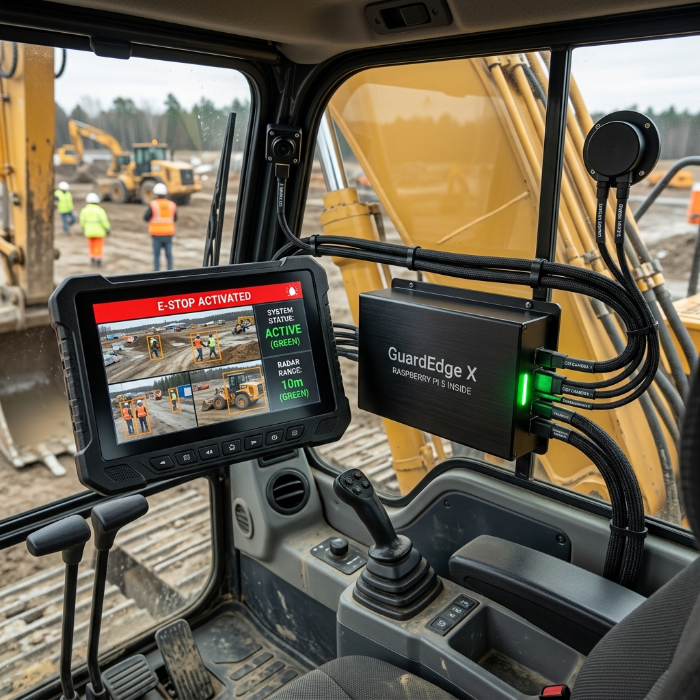

# GuardEdge X: Project Design & Innovation Overview
### Tata Technologies InnoVent 2026 Submission Manual
**Track:** Industrial Automation, IoT & Safety Systems  
**Target Domain:** Heavy Construction, Open-cast Mining & Infrastructure Operations  

---

## 📷 Prototype Concept Rendering

Below is the design mockup of the GuardEdge X hardware prototype console, illustrating the HMI display interface and local edge processing enclosure mounted within the operator cabin:

---

## 1. Problem Statement & Industrial Context
Heavy industrial machinery (e.g., excavators, haul trucks, crawler cranes, wheel loaders) operates in dynamic, high-risk environments. These vehicles present two critical safety challenges:
1. **Severe Blind Spots:** Rear-facing and side-facing zones are completely obscured from the operator's line of sight. Passive radar sensors or simple backup cameras fail to differentiate between stationary obstacles (heaps, rocks) and ground personnel.
2. **Operator Fatigue & Warning Fatigue:** 10-to-12 hour shifts under dusty, low-illumination conditions lead to micro-sleeps and distraction. Furthermore, cheap beep-alarm sonar systems beep constantly near dirt mounds, leading to operators muting or ignoring the safety sirens.

---

## 2. The GuardEdge X Solution
GuardEdge X introduces an intelligent, proactive safety copilot running entirely offline on a localized low-cost SBC (**Raspberry Pi 5**). 

### Technical Innovations
* **Asynchronous EKF Sensor Fusion:** Merges the wide-angle camera’s bounding boxes (YOLOv8) with the 24GHz mmWave radar's radial velocity vectors (SEN0395). By executing an **Extended Kalman Filter**, the copilot tracks worker trajectory coordinates even in low visibility (dust, fog, rain) where optical cameras are blinded.
* **Physics-Based Dynamic Safety Bubble:** Unlike static radial boundaries, the safety envelope's size automatically stretches and contracts based on real-time vehicle velocity (read via CAN-bus) and braking latency physics:
  $$R_{bubble} = R_{base} + (v_{machine} \cdot t_{latency}) + \frac{v_{machine}^2}{2a}$$
* **Harness Solenoid E-Stop:** Integrates a physical 5V/10A optocoupler relay mapped to BCM Pin 18. Upon a critical collision vector threat (TTC < 1.0s), it triggers an ignition cut-off override, bypassing delayed operator reaction times.
* **Operator Attention Monitor:** Processes eye-closure (EAR), yawns (MAR), and head pitch drop metrics to identify drowsiness and activate PWM buzzers.
* **MediaPipe Hand Gesture Control:** Enables non-verbal controls (e.g., open palm ✋ signals a critical emergency stop, and thumbs-up 👍 resumes operation).

---

## 3. Commercial Feasibility & Bill of Materials (BOM)

The prototype is engineered using accessible, industrial-grade parts, ensuring high affordability and rapid scalability across fleet vehicles:

| Component | Part Model | Unit Cost (USD) | Source/Standard |
|:---|:---|:---|:---|
| **Core Compute** | Raspberry Pi 5 (8GB) | $80.00 | Standard SBC |
| **mmWave Radar** | DFRobot SEN0395 (24GHz) | $32.00 | UART Interface |
| **Optical Sensor** | Raspberry Pi Camera Module 3 | $25.00 | CSI Interface |
| **HMI Screen** | 7-inch IPS Touchscreen HDMI | $35.00 | 1024x600 Display |
| **Relay Actuator** | 5V 10A Active Low Relay Board | $3.00 | Optocoupled GPIO |
| **Notification Hub** | Active Piezo Buzzer + High-bright LED | $2.00 | GPIO Drive |
| **Chassis Enclosure**| Anodized Aluminum Case | $12.00 | Rugged Chassis |
| **Total Estimated BOM**| | **$189.00** | |

---

## 4. Socio-Economic & Safety Impact
* **Zero Accident Goal:** Prevents active worker-machinery crushing accidents by deploying hardware-level automatic interventions.
* **OSHA & DGMS Compliance:** Meets strict digital safety monitoring directives mandated by mine safety regulators (such as DGMS in India).
* **Affordable Retrofitting:** At under $200 per unit, GuardEdge X can be easily retrofitted onto older excavators and cranes, bypassing the need for proprietary, multi-thousand-dollar manufacturer packages.
